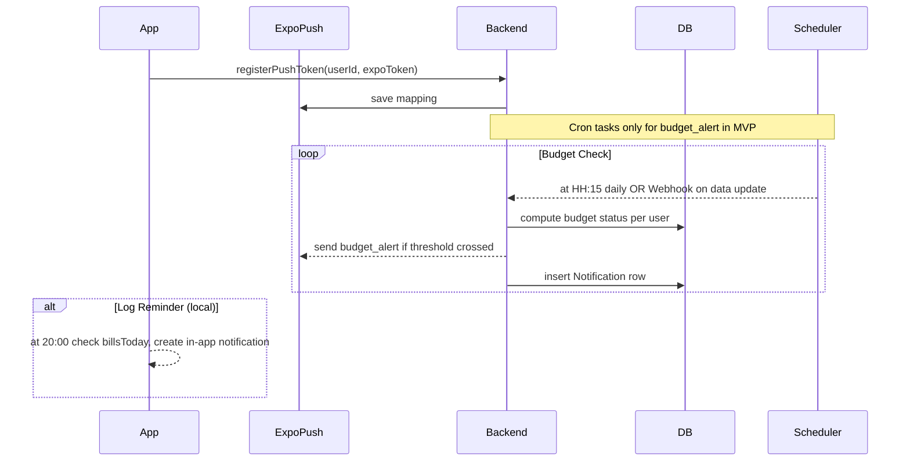

# MomiQ Notification System – Product Design Doc (v1.0)

> **Status**: Approved 2025-06-20 – initial scope focuses on _Log Reminder_ & _Budget Alert_ only. Other event types (bill due, family updates, weekly report, etc.) are hidden for now and will be enabled when corresponding features ship.

---

## 1. Goals

1. Deliver timely, actionable notifications without overwhelming the user.
2. Cover two immediate scenarios:
   • **Log Reminder** – gently nudge users to record expenses if they haven't done so today.
   • **Budget Alert** – inform users when spending crosses 80 % and 100 % of their monthly budget.
3. Provide in-app notification center with read/unread state & granular settings.
4. Future-proof architecture so new events can be switched on later.

## 2. User Stories

| #   | As a …                | I want …                                                         | So that …                |
| --- | --------------------- | ---------------------------------------------------------------- | ------------------------ |
| U1  | Forgetful user        | Receive a reminder at 20:00 if I haven't logged anything today   | Keep my records complete |
| U2  | Budget-conscious user | Get an alert when my monthly expense ≥ 80 % (and again at 100 %) | Adjust spending in time  |

## 3. Notification Types (MVP)

The system recognises **six** notification categories. Only `log_reminder` and `budget_alert` are active in version 1.0; the remaining four are kept in the data model & backend but其 UI 开关默认灰置，等待相关业务上线。

| Key             | Trigger / Business Rule                                             | Channel                  | Default | v1.0 Status |
| --------------- | ------------------------------------------------------------------- | ------------------------ | ------- | ----------- |
| `log_reminder`  | Daily 20:00 – _no bills recorded for current day_                   | in-app _(push optional)_ | ✅      | ✅ active   |
| `budget_alert`  | On data refresh – monthly total crosses 80 % or 100 % of budget     | push + in-app            | ✅      | ✅ active   |
| `bill_due`      | X days before a scheduled bill due date (T-1 by default)            | push + in-app            | ✅      | 🔒 hidden   |
| `family_update` | A family member adds / deletes / edits a bill                       | push + in-app            | ✅      | 🔒 hidden   |
| `weekly_report` | Every Monday 08:00 – summary of last week                           | push + in-app            | ❌      | 🔒 hidden   |
| `system`        | Official announcements / version updates (adhoc, backend triggered) | in-app only              | ✅      | 🔒 hidden   |

_Legend_: 🔒 hidden = kept in schema & APIs but UI 开关 disabled; no push sent until对应业务 ready.

## 4. Architecture & Flow

## 5. Data Model

(unchanged – server table ready but only two types used)

## 6. Settings UI

Notification switches retained, but _Bill Reminders_ & _Family Updates_ toggles are disabled (greyed out) until feature launch.

## 7. Mobile Implementation Task List

1. **NotificationProvider**
   - Persist `notifications` & `settings` to AsyncStorage.
   - `syncNotifications()` pulls from `/api/notifications` and merges.
   - `useEffect` listening to `bills`, `budgets`, `dataVersion` to fire `budget_alert` locally if thresholds crossed & not already notified for that month/level.
   - Daily `log_reminder` via `expo-task-manager` + `expo-background-fetch` or fallback App foreground check at 20:00.
2. **Settings & UI**
   - Disable switches for hidden types.
3. **Server**
   - `/api/push/register`, `/api/notifications`, budget-alert Scheduler job.

## 8. Acceptance Criteria

- When monthly spent crosses 80 % user receives _only one_ 80 % alert, another at 100 %.
- At 20:00 with zero bills today, _log reminder_ appears.
- Notification center reflects read/unread & counts.
- Hidden types not exposed in UI.

---

_Prepared by AI assistant in collaboration with product._
